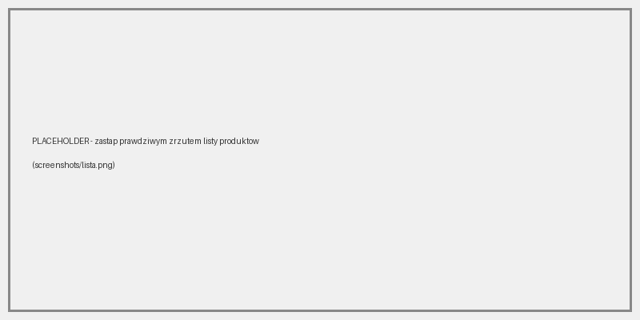

# Product Manager

Prosta aplikacja webowa we Flasku do zarządzania listą produktów. Przeznaczona do nauki tworzenia aplikacji z bazą danych i szablonami.

## Technologie

- Python 3.12, Flask 3, Flask-SQLAlchemy
- SQLite
- Jinja2, CSS

## Uruchomienie

```powershell
python -m venv venv
venv\Scripts\activate
pip install -r requirements.txt
python app.py
```

Aplikacja: http://localhost:5000

## Struktura

```text
app.py        – konfiguracja i widoki
models.py     – modele SQLAlchemy
templates/    – szablony Jinja2
static/       – CSS
docs/         – dokumentacja i notatki
screenshots/  – zrzuty ekranu aplikacji
```

## Trasy

| Metoda   | Adres                   | Opis      |
|----------|-------------------------|-----------|
| GET      | `/products`             | lista     |
| GET      | `/products/<id>`        | szczegóły |
| GET/POST | `/products/add`         | dodawanie |
| POST     | `/products/<id>/delete` | usuwanie  |

## Status

- [x] model `Product`
- [x] lista, szczegóły, dodawanie
- [ ] edycja
- [ ] wyszukiwarka



## Dokumentacja

- [Notatki o HTTP](docs/notes-http.md)

## Autor

Imię Nazwisko, 4TP, 2026/2027
